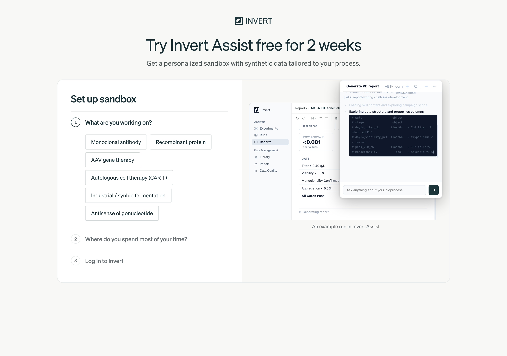
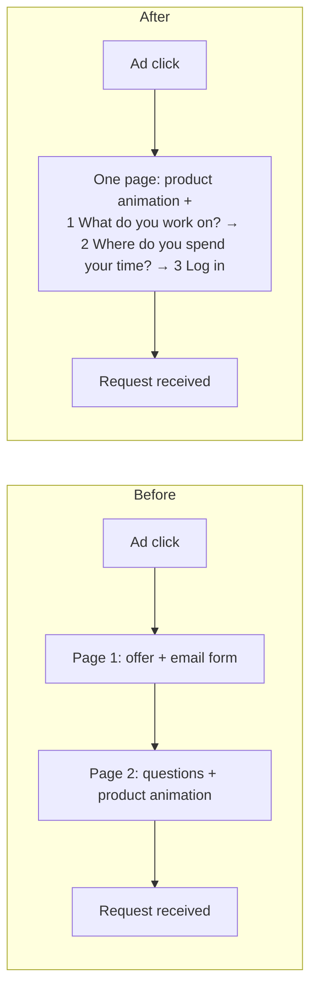
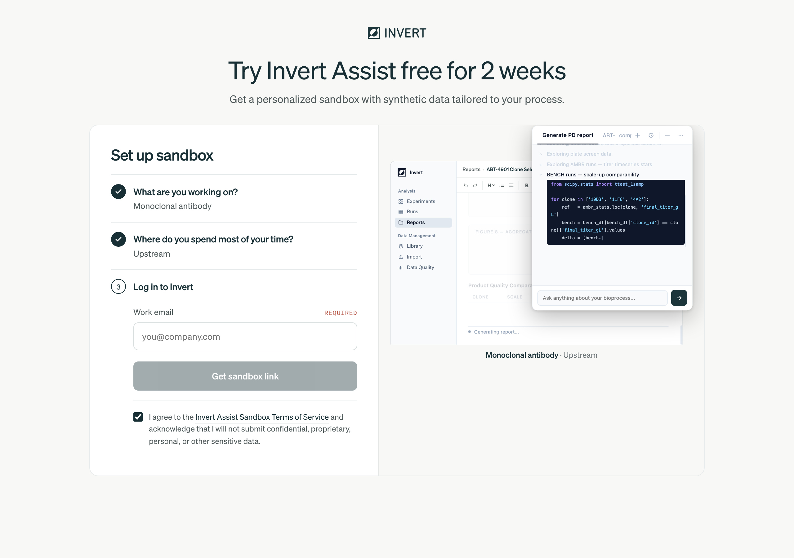
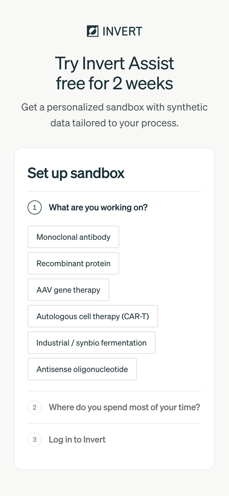

# Rebuilding a free-trial signup: one page, product first, email last

**Live:** https://invertbio.com/assist-trial
**Shipped:** September 24, 2026. Brief on September 23. Four merged changes in two days: the rebuild, a copy change, and two rounds of fixes from my own review of the live page.
**Type:** Conversion-flow redesign of a paid-traffic landing page.

## The strategy in one paragraph

The old flow made a promise on page one and showed the product on page two, and almost nobody reached page two. So the rebuild puts both on one page, leads with the product, and asks for the email address last. First come two questions a visitor answers with one tap each: what they work on (an antibody, a gene therapy, and so on) and which part of the process they spend their time in. Those answers tell the engineers what sample data to load. Then comes the email field. The accordion shows all three steps from the start but asks for one decision at a time, and each answer folds down so the visitor sees progress. The last step borrows the most familiar pattern on the web, "Log in", for the one field that costs the visitor something. I kept one rule: nothing on the page may promise instant access, because a person sets up each sandbox and the confirmation screen says so. One gap is still open. The product animation is hidden on phones, where most visitors are, so "product first" holds only on desktop for now.

## The brief

The offer is a two-week trial of the product's AI assistant, in a private sandbox loaded with synthetic data shaped like the visitor's process. A person sets up each sandbox by hand.

The trial had two pages. Page one had a headline, three explainer steps, an email form and a wall of integration logos. Page two had the setup questions beside an animated example of the product at work. My brief to Claude Code: make page two the first page, change the email section to say "Log in to Invert", do not show the email field up front, and have the steps unfold like an accordion as people click through.

## Step 1. What the data said before anything changed

The analytics read from the week before set the direction. Numbers are rounded, from the product-analytics tool and a server-side landing counter.

- **Fewer than 1 in 20 visitors reached page two.** Visitors saw the offer, and most of them left from page one.
- **About three quarters of paid traffic was on phones.** On a phone, half the page height was site footer, so scroll-depth numbers made the page look worse than it was. People saw the whole offer a quarter of the way down, and still left.
- **Page one had no product visual at all.** The only demonstration of the product was on the page almost nobody reached.
- **The email button on page one had never recorded a click.** It did a plain form submit, so the page unloaded before the click event could send.
- **The same submit dropped the whole query string.** The source tag, the campaign tags and the ad click id reached page two only because hidden fields and extra code put them back.
- **Browser analytics saw about one in five ad clicks,** because it runs only after cookie consent. A server-side landing counter, added the week before, closely matched the ad platform's click count, so that counter is the base for the funnel.

**Decision:** put the offer and the product on one page, and make the first action a tap. My bet was that page one asked for an email before the visitor had seen anything worth giving it for.

## Step 2. Decide what "Log in" means

"Log in to Invert" with no visible email field is harder than it sounds, because the email address is the whole point of the form. Before any code, Claude Code checked the product's real sign-in page and asked me to choose. The real page asks for an email first, and there is no self-signup. That left three options:

| Option | What it means | Why I chose it or not |
| --- | --- | --- |
| **Email field appears when the step opens** | The last row reads "Log in to Invert"; the field shows only inside it | **Chosen.** Lead capture, analytics and ad tracking stay exactly as they were. No new setup. |
| Google or Microsoft sign-in | No email field at all; the address comes from the identity provider | Needs OAuth apps set up in two consoles, and a new privacy surface. Too much for a label change. |
| Send people to the real app's login | The button opens the product's sign-in page | New visitors have no account, so they would stop there, and the lead would be lost. |

I also kept the page-one headline ("Try Invert Assist free for 2 weeks") above the card, so the offer an ad visitor clicked on is the first thing they read.

**The tension I accepted on purpose.** "Log in" suggests an account exists. None is created. The label is there to make the last step feel familiar. The confirmation screen then states plainly that engineers build the sandbox by hand and email within 1 to 3 business days. I would not accept any wording that implied instant access. That is a standing rule for this offer.

## Step 3. Write down what must not break

A signup form is the least visible part of the funnel and the easiest to break silently. Before editing, I listed what the old flow did. The After column shows the finished build, including two items that came later.

| Behavior | Before | After |
| --- | --- | --- |
| A record when the email is entered | Sent when page two loaded with the address from page one, or when the field lost focus | Sent when the email field loses focus. The address is now typed on this page. |
| A record when the form is submitted | Once, guarded against double clicks | Same |
| Personal addresses (Gmail and similar) | Refused, logged separately, never counted as a lead | Same |
| Ad-platform lead and conversion events | Once per fill, with one dedupe id | Same |
| Source attribution (which page or ad sent the visitor) | Carried across the page change by hidden fields and extra code | **Better.** The flow stays on the landing URL, so every signup keeps its source, and that code was deleted. The stored page URL keeps only a short allowlist of tracking parameters, so nothing else in the address bar ends up in the lead record. (The allowlist came from the review in Step 5.) |
| Old links to page two | n/a | Forward to the new page with every parameter except the email address |
| Printed QR codes | Pointed at page one | Still work. After the build, I decoded the QR images in the booth banner and one-pager files. They point at the page-one URL, which is now the whole flow. |

## Step 4. Build it

The accordion is small, but some details matter:

- Panels open with a CSS grid trick: the row grows from zero to its natural height (`0fr` to `1fr`), so the script never measures heights. A closed panel is `inert`, which takes it out of keyboard and screen-reader reach.
- A pick folds its own step. The button just pressed is now inside a closed panel, so focus would fall back to the top of the page. Instead, focus moves to the next step, without scrolling the page (`preventScroll`).
- The first phone check found a real bug. A long answer, kept on one line, made the form wider than the card. The fix was one `min-width: 0` on the form column.

I verified locally with the integrations switched off, so test signups wrote only a log line and never reached the queue a person works from.

## Step 5. Adversarial review before merge

Before merging, I ran nine agents. Four reviewers each had one lens, and a fifth ran the production build. Each lens then got a skeptic, told to refute every finding. A finding stayed only if the skeptic could reproduce it from the code. The lenses were: capture and attribution, the accordion's states and accessibility, framework correctness, and copy and leftovers. Prompts are in [`prompts/`](prompts/).

It confirmed ten findings (some found by two lenses) and refuted three. The ones that mattered:

- **A first-load dead end (high).** If a visitor clicked the header of the open first step before picking anything, the step folded and became disabled. With steps two and three still locked, nothing on the page could be clicked. The fix was a new header state, "to do": reachable, unanswered, and always clickable. It sits beside the other four: open, done, next and locked.
- **Lost keyboard focus after the second answer (medium).** On the first pass, the second pick folded its panel and moved focus nowhere.
- **Clipped focus rings (low),** a click event that also fired when a step closed, a stale code comment, and the tracking-parameter allowlist from Step 3.

Two of the refuted findings were wording preferences or things already true before the change. The third, a cut-off answer, was refuted only for phones. On desktop it was real, and my own live review caught it later. The review took about five minutes to run. The dead end alone justified it. I had tested every path except "click the header of the step you are already on".

## Step 6. Ship and verify on production

GitHub checks each pull request against the main branch only. A teammate's draft pull request changed the same file, so I also checked my branch against theirs. The overlap was one line, and they will resolve it in their branch. After the merge, I checked production directly. The new page loaded. The old page-two URL forwarded visitors with a temporary redirect (HTTP 307) and without the email address. The exact URL in the QR codes loaded the new page with no redirect.

## Step 7. The review that changed it

My own pass on the live page, later the same day, produced the most changes. Each came from the same question: what does this ask of the visitor, and is it worth it?

- **Removed the helper line under the email field** ("So you can get back into your sandbox"). It explained something nobody needed explained.
- **Removed the product-update emails toggle.** It added a decision to the step that costs the most, and it was off by default, so it said we did not want it much either.
- **Moved the terms line under the button.** The form now stores the terms acceptance only with the final submission, when the visitor clicks the button.
- **Opened step three automatically** when the second question is answered. The extra click to open "Log in" had no decision in it.
- **Renamed things to say what happens.** The card heading became "Set up sandbox", and the button became "Get sandbox link". "Get" names the outcome and says nothing about timing. The link arrives by email from an engineer, and the confirmation screen gives the 1 to 3 business days.
- **Put each answer under its question at every width.** The first release put it on the right on wider screens, and long answers were cut off.
- **Pinned the animation to the top of the card,** flush with the card's top edge. Centered, it moved up and down every time a step opened, and that motion looked like a glitch.
- **Showed the email error only after the visitor leaves the field.** An address is invalid at every keystroke until it is finished, so a live error scolds people mid-word. The error clears as soon as they go back in.
- **Made autofocus visible.** Focus already moved to the email field. But after a mouse click, browsers skip their default focus ring when code moves the focus, so the field looked inactive. A focus style of its own fixed it.

## Step 8. Operations around the form

Two changes outside the page:

- **The automatic acknowledgement email is off.** The lead table had an automation that emailed every completed signup. We now follow up personally, so I turned the automation off. I did not delete it, so it can come back.
- **The chat alerts stayed on.** The first question was whether they would stop too. They do not: the site's own backend sends them, not the lead table. I checked that before touching anything, so I did not break them along with the email.

## Measuring it

The new funnel has one event per step: first question answered, second question answered, and "Get sandbox link" clicked. The old page-one events stopped on the day of the change, so any before-and-after comparison has to start there. The base is the server-side landing count, because browser analytics sees only visitors who accept cookies. At current traffic, an A/B test cannot give a result yet, so I compare before and after. The fair measure is completed signups per landing, because one tap on the new page is not the same effort as an email address on the old one. I will check after two full weeks of traffic on the new page.

## What I would do differently

1. **Decide about phones on purpose.** Most of the traffic is on phones, and the product animation is still hidden on screens narrower than 780 pixels, which is every phone, as it was on the old page two. I kept that choice without deciding it.
2. **Test focus with real clicks.** When a check drives the page with script clicks, the browser window can lack focus, so `:focus` does not apply and the field reads as unfocused. Two of my verification passes gave the wrong answer that way before I switched to real clicks.
3. **Check printed QR codes before touching any URL.** I did check, but after the build. If they had pointed at the old page two, the redirect would have been the only thing between a booth visitor and a dead link.
4. **Instrument before redesigning.** The old email button never recorded a click, so I rebuilt a funnel whose middle step I could not see. The new events came with the rebuild, but a week of clean data on the old flow would have made the comparison fair.

